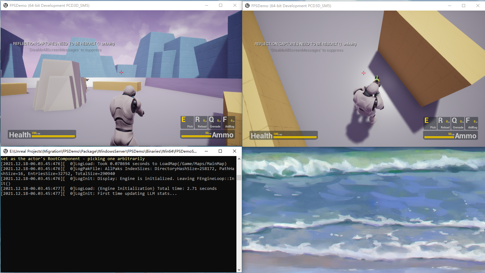

# FPSDemo
## Release V3.0.0 文件说明
1. FPSDemo.zip 游戏工程文件
2. Packaged.zip 游戏打包文件
## 打开服务器与客户端
1. 首先打开'Packaged/WindowsServer/FPSDemoServer.exe -MainMap'打开独立服务器
2. 其次分别打开两个'Packaged/WindowsNoEditor/FPSDemo.exe'加入游戏
## 游戏流程
1. 首先进行双人联机对战，击败对手，拾取奖励
2. 胜利者进行接下来的游戏，击败机器人，挑战机械Boss
3. 记住灵活拾取地图中的补给物
## 操作指南
1. WASD移动，Space跳跃，左键攻击，右键切换视角
2. E拾取，R换弹夹，Q投掷手雷，F回复血量
## 补给物
1. 弹匣
2. 手雷
3. 医疗包
4. 记得及时补给哦

